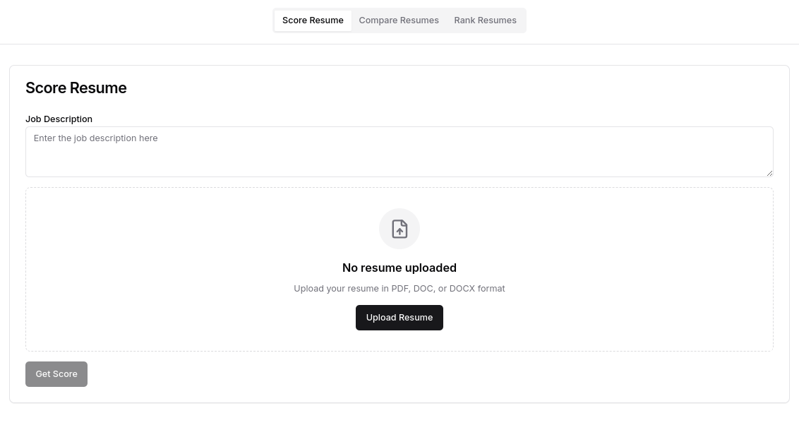
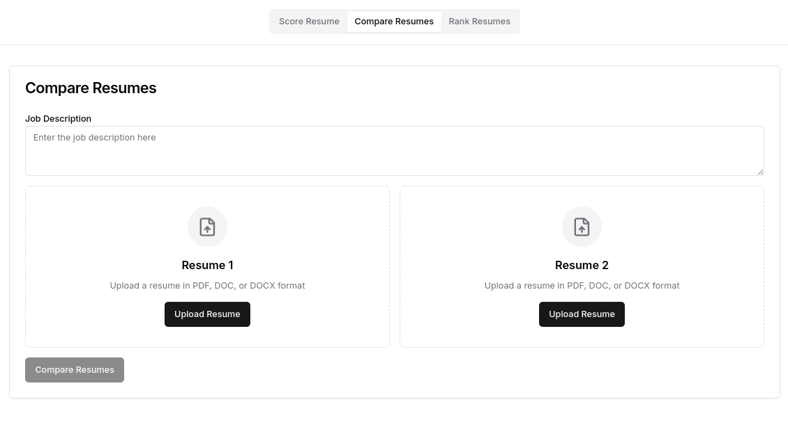

# ResuMate 📝

**Analyze, Compare, and Rank Resumes with Ease**

 
 
 

ResuMate is a web-based tool designed to analyze, compare, and rank resumes based on job descriptions. It leverages **Natural Language Processing (NLP)** using **Java libraries** to extract meaningful insights, ensuring accurate scoring and comparison of resumes. This tool simplifies the hiring process by providing actionable insights to both job seekers and recruiters.

---

## 🚀 Features

1. **Score Resumes**  
   Analyze a resume against a job description and get a detailed score with insights on strengths and weaknesses.

2. **Compare Resumes**  
   Compare two resumes side-by-side to determine which one better fits the provided job description.

3. **Rank Resumes**  
   Bulk upload multiple resumes and rank them based on their alignment with the job description.

---

## Technologies and Tools 

### Frontend
- **React** with **TypeScript**
- **CSS Framework**: TailwindCSS

### Backend
- **Spring Boot**
- **Java**
- **REST APIs**

### DevOps
- **GitHub Actions**: Used for automating backend builds and tests during pull requests or commits to the master branch.

---

## Development Workflow 

### Frontend
1. The React frontend will be deployed to **Vercel**.
2. It will communicate with the backend using REST APIs.

### Backend
1. The Spring Boot backend will be deployed to **Railway**.
2. **GitHub Actions** will handle:
   - **Building**: Ensuring the backend compiles successfully.
   - **Testing**: Running unit and integration tests automatically.
   - **Quality Assurance**: Ensuring that the master branch always contains stable code.

---

## Future Enhancements ✨
- **Integration with AI**: A chatbot to suggest resume improvements based on the analyzed results.
- **Advanced Analytics**: Include insights into industry trends based on job descriptions.

---

## NLP in ResuMate

NLP plays a crucial role in powering the resume analysis and ranking capabilities of ResuMate. Here’s how it’s used:

1. **Resume Scoring**:
   - Extracts key information from resumes and job descriptions.
   - Matches skills, qualifications, and experiences using Java-based NLP techniques.

2. **Resume Comparison**:
   - Uses NLP libraries to compare two resumes in terms of relevance to a given job description.
   - Highlights strengths and weaknesses in both resumes.

3. **Resume Ranking**:
   - Processes multiple resumes in bulk.
   - Ranks resumes based on their fit for a specific job using NLP algorithms.

By integrating NLP, ResuMate ensures high accuracy and relevance in its analysis, making it a powerful tool for Resume Analysis.

---

## Design Mockups of the UI

### 1. Score Resume

### 2. Compare Resumes

### 3. Rank Resumes

---

## License

This project is licensed under the [MIT License](LICENSE).

---

Feel free to contribute or suggest improvements by opening an issue or submitting a pull request!

