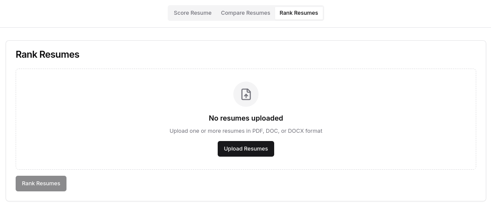

# ResumeMate 📝

**Analyze, Compare, and Rank Resumes with Ease**

 
 

ResumeMate is a web-based tool designed to analyze, compare, and rank resumes based on job descriptions. It simplifies the hiring process by providing actionable insights to both job seekers and recruiters.

---

## Features

1. **Score Resume**  
   Upload a single resume and a job description to get a relevance score and suggestions for improvement.

2. **Compare Resumes**  
   Compare two resumes against each other and a job description to identify strengths and weaknesses.

3. **Rank Resumes**  
   Bulk upload multiple resumes and rank them based on their relevance to a given job description.

---

## Technologies and Languages Used

- **Frontend**: React with TypeScript using ShadCN for styling and UI components.
- **Backend**: Spring Boot (Java) for handling APIs and logic.
- **File Uploads**: Integration for PDF, DOC, and DOCX formats.
- **Styling**: TailwindCSS with ShadCN integration.
- **State Management**: React's `useState` and `useEffect`.

---

## Screenshots of the UI

### 1. Rank Resumes

### 2. Compare Resumes

### 3. Score Resume

---

## Contribution Guidelines

Contributions are welcome! To contribute:
1. Fork the repository.
2. Create a new branch.
3. Make your changes and commit.
4. Submit a pull request for review.

---

## License

This project is licensed under the [MIT License](./LICENSE). See the `LICENSE` file for details.

